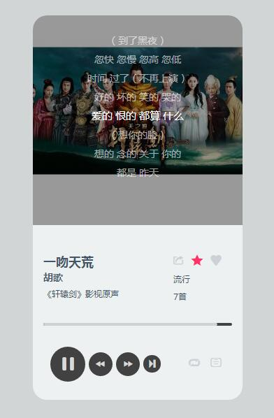

技术栈：HTML5 + CSS + jQuery。

——2016-12-22——

本项目是根据Baidu 音乐API实现网页在线播放器，目前具有以下基本功能：

1. 可以控制暂停，播放；

2. 可以前后切歌；

3. 动态显示歌词；

4. 实现歌曲播放进度条；

5. 可以切换歌词显示还是隐藏。

——2016-12-23——

6. 添加收藏功能，收藏的歌曲默认加入到播放列表尾部；

7. 添加频道切换和当前频道、播放列表歌曲总数显示功能；

8. 修复单行歌词溢出导致歌词滚动出错问题。

9. 添加拖动进度条，改变播放进度

