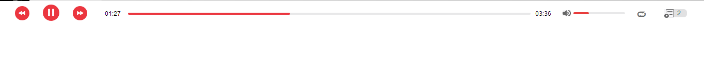
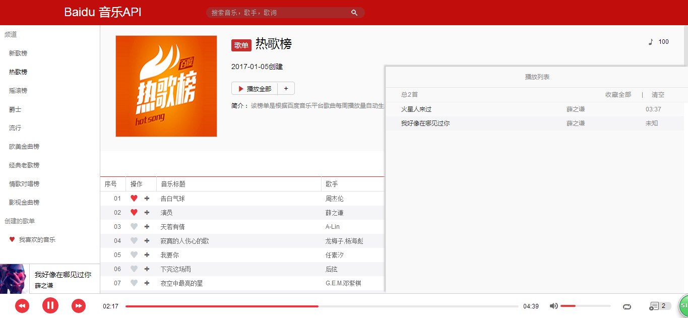
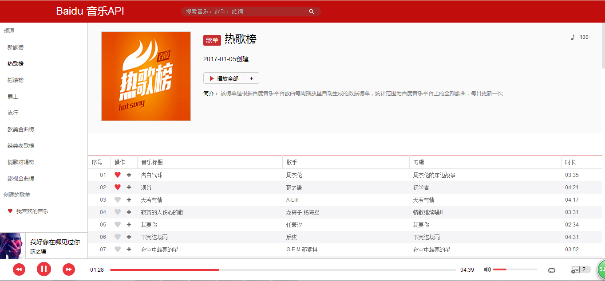
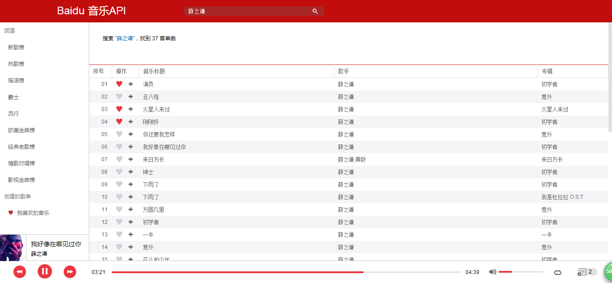
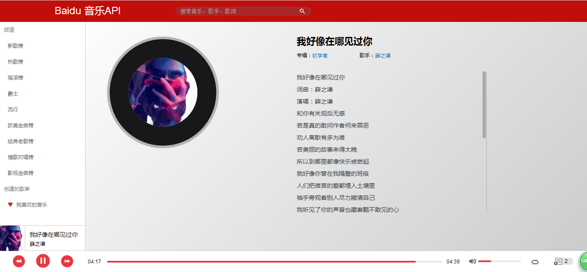

本项目采用ES6+React+React-Redux+Router+webpack+npm+CSS3+baidu音乐API实现一个单页面播放器应用.

可以克隆本项目,点击index.html查看demo.

目录结构如下所示：

|——dist

|——demo-img

|——src

    |——css

    |——html

    |——img

    |——js

    	|——Components

    	|——Constants

    	|——Containers

    	|——redux

    	|——router

    	|——util

|——package.json

|——webpack.config.js

主要实现功能：

1.播放器模块: 播放/暂停,下一首,上一首,进度条(展示与拖动改变播放时长),音量,模式(随机/顺序播放),基本信息展示

2.播放列表：展示当前播放列表,可以通过播放器面板按钮切换隐藏和显示。可以收藏全部或者清空,点击切换当前播放歌曲。

3.本地列表：存放、展示收藏的歌曲，通过LocalStorage与JSON技术将本地列表数据本地存储。可以将单个歌曲加入播放列表,取消收藏,双击立即播放或者播放全部.

 

4.频道列表：请求和展示不同频道的内容。可以将单个歌曲加入播放列表,收藏/取消收藏,双击立即播放或者播放全部.

 

5.关键字搜索：请求和展示搜索内容。可以将单个歌曲加入播放列表,收藏/取消收藏,双击立即播放.(查询时,在右上角展示Loading字样)

 

6.歌词展示：展示歌词(暂时没有做歌词滚动).

 

----------------------------通过本项目实践,更加理解React,Redux---------------------------------------

还有很多不足之处，比如: 分页请求,过渡动画等

ps: 感谢百度音乐API,和网易云音乐(界面布局风格参考,原因云音乐很好看啊。。。)